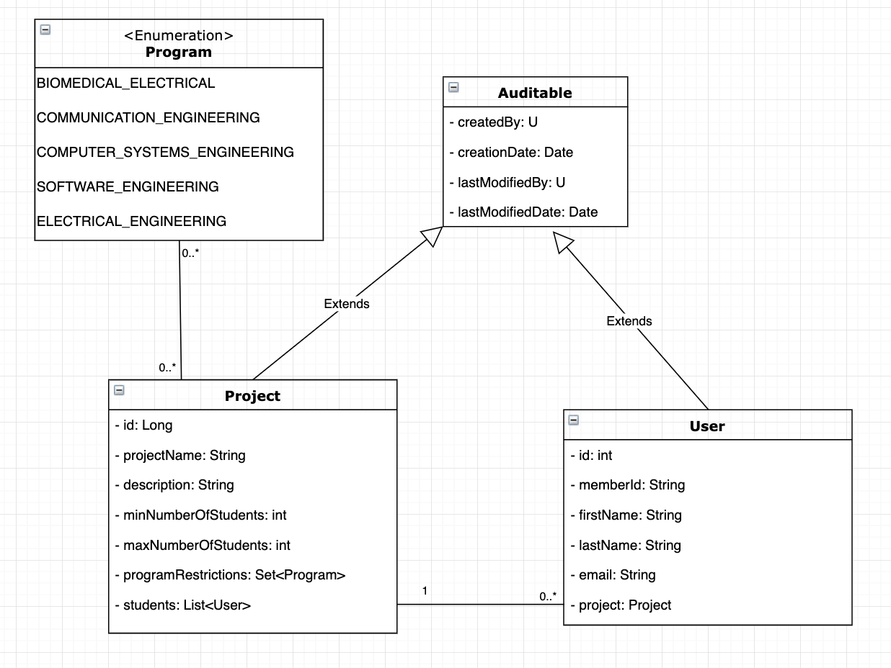

### 4th-year-Project-Website

# Project Description
This project is a web application to manage 4th year engineering capstone projects. This application is targeted towards students, professors, and program coordinators to help them manage all of the capstone projects for a given year. Additionally, this application allows students to submit documents, receive updates from the professors and coordinators, and register for presentations or meetings.

# MVP Key Features
- The application will have 3 main views; a home view, a student view, and a professor/coordinator view.
- The home view will display the list of capstone projects along with their relevant details. Users will be able to search through these projects.
- The application will offer authentication to allow users to log in as students, professors, or coordinators.
- In the student view, students will be able to register for projects.
- Once already registered, students will be able to submit documents for their project through the student view.
- In the professor view, professors will be able to add projects for students to register for, edit projects and archive them.
- Professors will also be able to download documents submitted to the projects they have added.
- Coordinators will be able to change deadlines for the different documents to be submitted, as well as send mass emails to students of a group or all students of all groups

# Model UML Class Diagram

# ER Diagram

# Current Status
- The base project has been deployed on Heroku
- The Github repository has been connected with Travis CI and Heroku
- The entity classes for the projects and users have been created
- A ProstgreSQL server has been set up on the Heroku server
- The application uses repositories to handle persistence
- The header has a button linking to the log in / sign up page
- The basic home view is working with announcements and projects pages
- If logged in as a student, the home view holds a link to the student view
- If logged in as a professor, the home view holds a link to the professor view
- The announcements view displays all the announcements
- If logged in as a coordinator, the announcements view allows for adding, deleting, or editing announcements
- The projects view displays all the projects that were added and not archived
- The projects view has links for every project to lead to detailed project pages
- If logged in as a student who does not currently have a project, the projects view has buttons for students to join projects
- The professor view is working; here the professor can add new projects, edit existing projects, and archive existing projects
- The student view is working; here, details about the student and their registered project are displayed
- The footer for all pages is set up to mimic actual Carleton web pages

# Sprint [Mar 20 - Apr 3]
- [ ] Registration
- [ ] Sign in
- [ ] Authorization
- [ ] Student view
- [ ] Student project registration
- [ ] Coordinator announcements